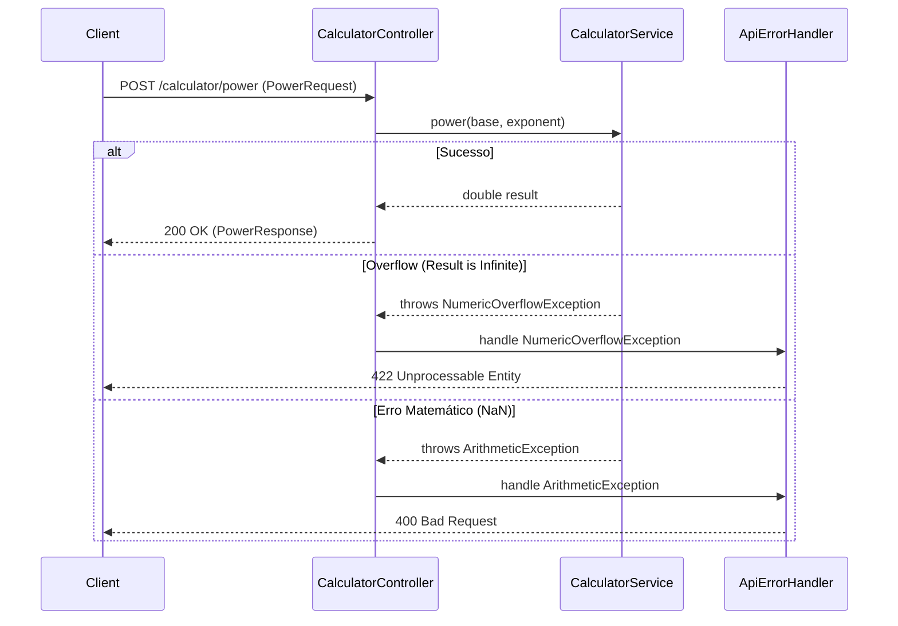

# 02 — High-Level Technical Design: Endpoint Potenciação

## Architecture Diagram

## Component Responsibilities
- **PowerRequest (DTO):** Validação sintática (campos obrigatórios).
- **CalculatorController:** Recebe a requisição, delega ao Service e mapeia a resposta de sucesso.
- **CalculatorService:** Executa `Math.pow`, verifica se o resultado é `Infinity` (overflow) ou `NaN` (inválido) e lança as exceções apropriadas.
- **ApiErrorHandler:** Intercepta as exceções e retorna o status HTTP correto (400 ou 422) com uma mensagem descritiva.

## Data Flow
1. JSON Input -> `PowerRequest` (Record).
2. `CalculatorController` chama `CalculatorService.power`.
3. `CalculatorService` calcula o valor.
4. Se o resultado for válido, retorna `double`.
5. Se inválido, lança exceção.

## Security and Observability Requirements
- Validação de entrada para evitar processamento de payloads maliciosos.
- Log de erros de overflow para monitoramento de uso extremo da API.

## Trade-Offs and Alternatives
- **BigDecimal vs Double:** Manteremos `Double` para o cálculo de potência (`Math.pow`) por ser a implementação padrão da JDK que lida com expoentes fracionários. O uso de `BigDecimal.pow` é limitado a expoentes inteiros.
- **Exceção Customizada:** Criar `NumericOverflowException` permite um mapeamento limpo para o status 422 no `ApiErrorHandler`.

## High-Level Test Scenario Map
- Teste de unidade do Service com valores normais, potências de 0 e 1.
- Teste de unidade do Service para overflow (10^1000).
- Teste de integração (MockMvc) validando os status 200, 400 e 422.
