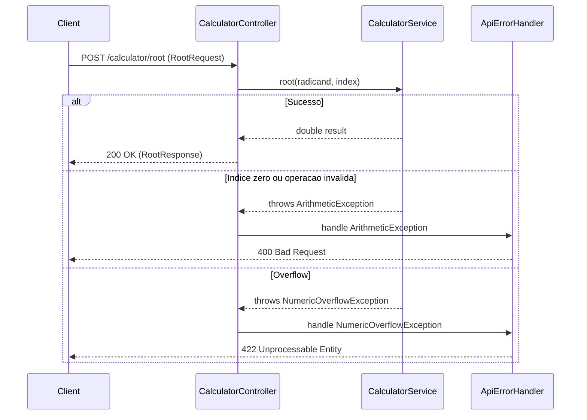

# 02 — High-Level Technical Design: Endpoint Raiz

## Architecture Diagram

## Component Responsibilities
- **RootRequest (DTO):** Representa o payload de entrada com `radicand` e `index`, ambos obrigatorios via `@NotNull`.
- **RootResponse (DTO):** Representa a resposta de sucesso com `result`.
- **CalculatorController:** Expoe `POST /calculator/root`, valida o request, delega ao service e retorna `RootResponse`.
- **CalculatorService:** Calcula a raiz como `Math.pow(radicand, 1.0 / index)`, bloqueia indice zero, detecta `NaN` e `Infinity`, e lanca excecoes compativeis com o handler existente.
- **ApiErrorHandler:** Reutilizado sem alteracao para mapear `ArithmeticException` para 400 e `NumericOverflowException` para 422.

## Data Flow
1. Cliente envia JSON para `POST /calculator/root`.
2. Spring desserializa o payload em `RootRequest`.
3. Bean Validation rejeita campos ausentes antes de chamar o controller.
4. `CalculatorController` chama `CalculatorService.root(radicand, index)`.
5. `CalculatorService` calcula e valida o resultado.
6. Em sucesso, controller retorna `200 OK` com `RootResponse`.
7. Em erro, `ApiErrorHandler` retorna o status e `ErrorResponse` correspondente.

## Security and Observability Requirements
- Nao adicionar dependencias novas.
- Rejeitar payloads invalidos usando validacao e parsing ja existentes.
- Evitar retorno de `NaN` ou `Infinity` no JSON.
- Manter mensagens de erro previsiveis para contratos HTTP.

## Trade-Offs and Alternatives
- **`Math.pow` com `double`:** Preserva o padrao do endpoint de potenciacao e atende raizes fracionarias sem dependencias adicionais.
- **Raiz impar de negativos:** Nao sera tratada manualmente no desenho inicial; se `Math.pow` produzir `NaN`, sera considerada operacao invalida. Isso mantem escopo minimo e consistente com a politica de nao suportar numeros complexos.
- **Sem novo handler:** Reutilizar `ApiErrorHandler` reduz superficie de mudanca e mantem o contrato de erro existente.

## High-Level Test Scenario Map
- Teste unitario para raiz quadrada valida.
- Teste unitario para raiz cubica valida.
- Teste unitario para indice zero lancando `ArithmeticException`.
- Teste unitario para resultado `NaN` lancando `ArithmeticException`.
- Teste de integracao para `POST /calculator/root` com sucesso 200.
- Testes de integracao para campos ausentes e JSON invalido retornando 400.
- Teste de integracao para operacao invalida retornando 400 com `ErrorResponse`.
